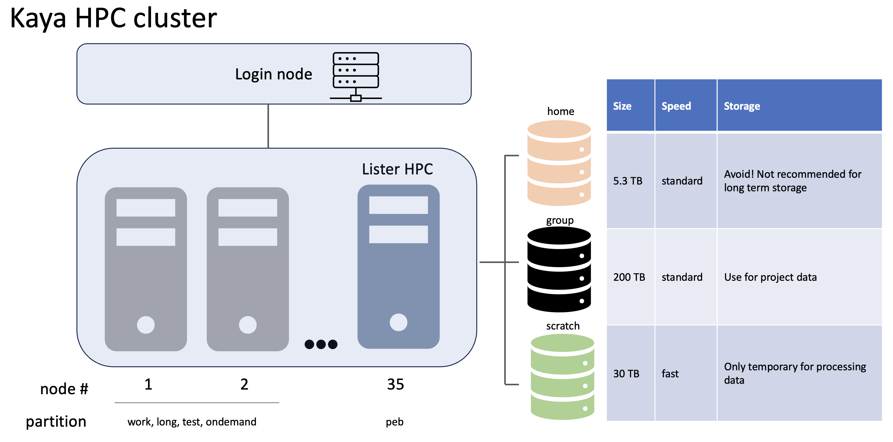

#  Kaya-HooperLab-recipes
This repository contains materials, resources and a collection of recipes useful for the High-Performance Computing (HPC) in KAYA. Covered topics related to HPC include Unix, SSH, scripting, version control using Git and GitHub, working with VS Code on remote servers, running Jupyter notebooks remotely, scheduling tasks with Kaya, and utilizing Kaya on Demand GUI. The Readme file contains an overview of the process and links to recipes.

## Intro to HPC
This landing page gives you an overview HPC and how it is put together. For the novice it is a good read so you know where things are and whatthey generally mean. If you are looking for a specific code please go to the Recipies directory or under Quick links. For Group owners or if you need to install someting you might find useful things under Admin SOPs. This includes setting up standard permissions, dealing with mulitple groups, creating modules and benchmarking etc.

## Contents Exchange Table

### Basics when starting and finishing
1. [Get Started on Kaya in the Hooper](sops/GetStarted.md)
2. [Group Data Storage](sops/DataStorage.md)
2. [Slurm Intro](sops/SLURMintro.md)
3. [Hand Over](sops/handover.md)

### More advanced items
- [Bespoke Software Installation](sops/AdminSOP.md)
- [Recipes Directory](recipes/RecipesDir.md)
<!-- - [Setting up Julia Projects](Julia_projects.md) -->
- [Benchmarking](sops/benchmarking.md)

## Resources useful for novices and beyond:
- [ListerLab Tutorial](https://github.com/cpflueger2016/Kaya-ListerLab-Tutorial)
- [Software Carpentry Tutorials](https://github.com/swcarpentry/swcarpentry)
- [Unix Shell Introduction](https://swcarpentry.github.io/shell-novice/)
- [Git Introduction](https://swcarpentry.github.io/git-novice/)
- [Julia Programming Tutorial](https://carpentries-incubator.github.io/julia-novice/)
- [SLURM Cheat Sheet](https://www.chpc.utah.edu/presentations/SlurmCheatsheet.pdf)
- [Cloud Computing with BLAST](https://angus.readthedocs.io/en/2019/cloud_computing_intro.html#running-command-line-blast)
- [FileZilla](https://filezilla-project.org/download.php?type=client)
- [Pawsey Documentation](https://support.pawsey.org.au/documentation/display/US/Supercomputing+Documentation)
- [Pawsey MetaGenomics Workshop](https://linsalrob.github.io/ComputationalGenomicsManual/Workshops/COMBINE_WA_2024.html)

## Practical introduction to KAYA
Kaya is our HPC cluster that consists of many compute nodes that handle heavy computational tasks. These nodes can only be accessed through the **login node**, which serves as the gateway for users to access and manage their jobs on the cluster. For data storage, Kaya provides a **data drive** (e.g. `/group/peb007/`), where researchers can store their datasets and project files. There's also a **scratch drive** (e.g. `/scratch/peb007/`) available for temporary storage and fast data processing during computations and storing intermediate results during job execution.

*Thanks for lending the image [Christian](https://github.com/cpflueger2016/Kaya-ListerLab-Tutorial)*

In order to interact with the compute nodes you have to log onto KAYA from the UWA Intranet and schedule computing job. 

## What are the things that people talk of?
- Node
is equivalent to a computer unit
- CPU
performing the tasks
- RAM
fast storage while computing
working memory
- Storage
long term memory

You cannot "just" install stuff and download "pieces" and "get stuff running". This is a set up that you need submit jobs to from your "log on node". **IF YOU SET YOUR PROGRAM RUNNING WITHOUT SLURM YOU WILL BREAK YOUR NODE**

## SLURM what is it?
SLURM (Simple Linux Utility for Resource Management) is used for job scheduling on HPC clusters. It optimizes computing tasks on clusters and manages job scheduling efficiently. So in short it is the PA of the supercomputer that makes your appointment to use the high performance computing nodes that you need. This makes it more efficient for all users. You tell the PA what you need (do you need lots of memory or lots of processing?)

[SLURM Documentation](https://slurm.schedmd.com/)
 
 

The workflow involves preparing scripts for your computation and submitting them to the compute node using SLURM
- Prepare Data 
- Estimate job time and resource requirements
- Write and test scripts
- Submit scripts using SBATCH
- Monitor job progress and output

[More About SLURM](SLURMintro.md)

## Transferring Files:
Transferring files between local and remote systems is essential for HPC work. Tools like wget, curl, scp, and rsync are commonly used for this purpose.
- Securely transfer files using scp and rsync
- Mounting IRDS (Integrated Research Data Storage) on Kaya
- Utilize FileZilla for graphical file transfers

## GUI and Monitoring:
Accessing and monitoring HPC clusters can be done through web interfaces and command-line tools.

- Utilize HPC monitoring tools like top, htop
- Access Kaya interactively using OnDemand GUI
- Monitor cluster usage and performance at https://monitor.hpc.uwa.edu.au/

For more details and instructions, please refer to the specific sections in the workshop materials.

## Authors:
- Conny Hooper (cornelia.hooper@uwa.edu.au, GitHub: DrChooper)

...
