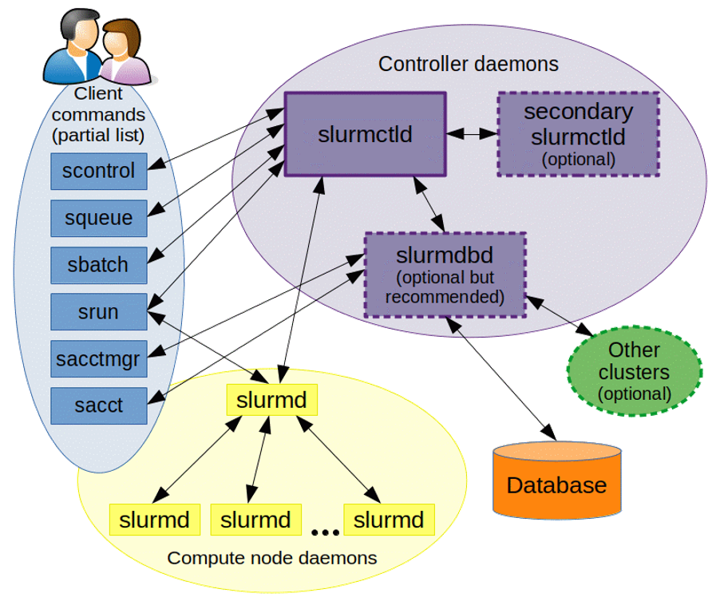

# Kaya-HooperLab-recipes
This repository contains materials, resources and a collection of recipes useful for the High-Performance Computing (HPC) in KAYA. Covered topics related to HPC include Unix, SSH, scripting, version control using Git and GitHub, working with VS Code on remote servers, running Jupyter notebooks remotely, scheduling tasks with Kaya, and utilizing Kaya on Demand GUI. The Readme file contains an overview of the process and links to recipes.

## Quick Link to recipes:
- [Recipes Directory](RecipesDir.md)

## Resources useful for novices and beyond:
- [ListerLab Tutorial](https://github.com/cpflueger2016/Kaya-ListerLab-Tutorial)
- [Software Carpentry Tutorials](https://github.com/swcarpentry/swcarpentry)
- [Unix Shell Introduction](https://swcarpentry.github.io/shell-novice/)
- [Git Introduction](https://swcarpentry.github.io/git-novice/)
- [Julia Programming Tutorial](https://carpentries-incubator.github.io/julia-novice/)
- [SLURM Cheat Sheet](https://www.chpc.utah.edu/presentations/SlurmCheatsheet.pdf)
- [Cloud Computing with BLAST](https://angus.readthedocs.io/en/2019/cloud_computing_intro.html#running-command-line-blast)
- [FileZilla](https://filezilla-project.org/download.php?type=client)

## Additional Resources:
- [Pawsey Documentation](https://support.pawsey.org.au/documentation/display/US/Supercomputing+Documentation)

## SLURM what is it?
SLURM (Simple Linux Utility for Resource Management) is used for job scheduling on HPC clusters. It optimizes computing tasks on clusters and manages job scheduling efficiently.

[SLURM Documentation](https://slurm.schedmd.com/)
 
 

## Setting Up Tasks for the Scheduler:
The workflow for setting up tasks for the scheduler involves preparing scripts and submitting them to SLURM for execution.

- Estimate job time and resource requirements
- Write and test scripts
- Submit scripts using SBATCH
- Monitor job progress and output

## Transferring Files:
Transferring files between local and remote systems is essential for HPC work. Tools like wget, curl, scp, and rsync are commonly used for this purpose.

- Securely transfer files using scp and rsync
- Mounting IRDS (Integrated Research Data Storage) on Kaya
- Utilize FileZilla for graphical file transfers

## GUI and Monitoring:
Accessing and monitoring HPC clusters can be done through web interfaces and command-line tools.

- Utilize HPC monitoring tools like top, htop
- Access Kaya interactively using OnDemand GUI
- Monitor cluster usage and performance at https://monitor.hpc.uwa.edu.au/

For more details and instructions, please refer to the specific sections in the workshop materials.

## Authors:
- Conny Hooper (cornelia.hooper@uwa.edu.au, GitHub: DrChooper)

...
